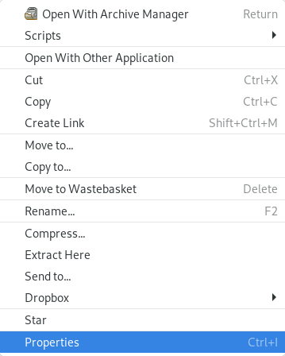

# Dealing with .jar files on linux

!!! note ""
	Kokou Elolo AMEGAYIBO - AKEAmazan ([OSM Togo](https://openstreetmap.tg/)) a traduit la page en français. Oeuvre originale de Sören Reinecke ([Trufi Association](https://trufi-association.org))

## Installation de Java

1. Ouvrez un terminal en appuyant sur la touche _WINDOWS_ de votre clavier et en tapant "terminal" dans la barre de recherche. Cela dépend du système d'exploitation et du menu de démarrage que vous utilisez, la façon dont la barre de recherche fonctionne en détail. Vous devrez peut-être l'activer d'abord pour commencer à taper.

2. Ouvrez le terminal en appuyant sur l'entrée qui apparaît. L'entrée doit être libellée comme suit `Terminal`, `Gnome Terminal` ou`Xfce Terminal` etc.

3. La fenêtre qui s'ouvre devrait ressembler à la mienne: 

4. Dans cette fenêtre, nous tapons `java -version` et nous appuyons sur la touche ENTRÉE pour vérifier si elle est déjà installée. La plupart des dérivés de Linux ont java installé par défaut.

5. Si votre fenêtre ressemble à ceci, vous avez déjà installé Java et vous pouvez ignorer _Installation de Java_: 

6. Si votre fenêtre ne ressemble pas à l'image ci-dessus, c'est que Java n'est pas installé. Dans ce cas, nous devons d'abord l'installer :
   
   - Installation sur **Debian**, **Ubuntu** et similaires comme **Kubuntu**, **Xubuntu**:
     
     - Tapez `sudo apt install openjdk-11-jre`. Si cela vous donne une erreur, essayez `su -c "apt install openjdk-11-jre"`. Comme chaque commande que nous tapons, elle nécessite également que vous appuyiez sur ENTRÉE pour l'envoyer à votre processeur. De plus, les deux commandes vous demandent votre mot de passe comme:
     
     - Saisissez votre mot de passe. C'est le mot de passe du compte root que vous avez défini lors de l'installation ou le mot de passe de votre utilisateur que vous utilisez pour vous connecter à votre ordinateur (s'il n'est pas désactivé). **Pour des raisons de sécurité, vous ne voyez pas ce que vous tapez. Vous ne voyez même pas un caractère "*" pour chaque caractère que vous tapez.**
     
     - On vous donnera un résumé de ce qui sera fait avec votre système et, à la fin, on vous demandera si vous êtes prêt à appliquer ces changements. 
     
     - Tapez `Y` et appuyez sur ENTRÉE. Il va maintenant télécharger et installer Java pour nous. Si vous apprenez à connaître `apt', cela vous fera gagner beaucoup de temps. Normalement, en tant qu'utilisateur de Windows, vous devez aller sur le site de téléchargement, télécharger l'installateur et l'exécuter, puis suivre les instructions d'installation. Sous Linux, cela n'est pas nécessaire.
   
   - Installation sur des systèmes de type Red-Hat, par exemple **Fedora**, **Oracle Linux**:
     
     - Tapez `sudo yum install openjdk-1.8.0-jre`. Comme chaque commande que nous tapons, elle nécessite également que vous appuyiez sur ENTRÉE pour l'envoyer à votre processeur. En outre, il vous demande votre mot de passe.
     
     - Saisissez votre mot de passe. C'est le mot de passe du compte root que vous avez défini lors de l'installation ou le mot de passe de votre utilisateur que vous utilisez pour vous connecter à votre ordinateur (s'il n'est pas désactivé). **Pour des raisons de sécurité, vous ne voyez pas ce que vous tapez. Vous ne voyez même pas un caractère `*` pour chaque caractère que vous tapez.**
     
     - On vous donnera un résumé de ce qui sera fait avec votre système et, à la fin, on vous demandera si vous êtes prêt à appliquer ces changements. 
     
     - Tapez `Y` et appuyez sur ENTRÉE. Il va maintenant télécharger et installer Java pour nous. Si vous apprenez à connaître `apt', cela vous fera gagner beaucoup de temps. Normalement, en tant qu'utilisateur de Windows, vous devez aller sur le site de téléchargement, télécharger l'installateur et l'exécuter, puis suivre les instructions d'installation. Sous Linux, cela n'est pas nécessaire.
   
   - **ToDo:** _Ajouter plus de dérivés de Linux_.

## Installation de JOSM

À ce stade, nous n'avons plus besoin du terminal.

1. Télécharger JOSM [ici](https://josm.openstreetmap.de/). 

2. Enregistrez-le sur votre ordinateur ou sur un périphérique de stockage portable. Enregistrez-le où vous voulez.

3. Avec votre navigateur de fichiers, allez à l'endroit où vous avez téléchargé le fichier. Faites un clic droit sur le fichier précédemment téléchargé et cliquez sur _Propriétés_:

4. Allez à la section _Permissions_ et cochez-y la case _Autoriser l'exécution du fichier comme programme_: 

5. Nous pouvons fermer la fenêtre et un double clic sur l'icône du programme devrait ouvrir JOSM. Si JOSM ne s'ouvre pas mais qu'une fenêtre apparaît et que vous voyez des boutons dont l'un est intitulé _Run_, alors cliquez sur ce bouton et JOSM devrait s'ouvrir.
